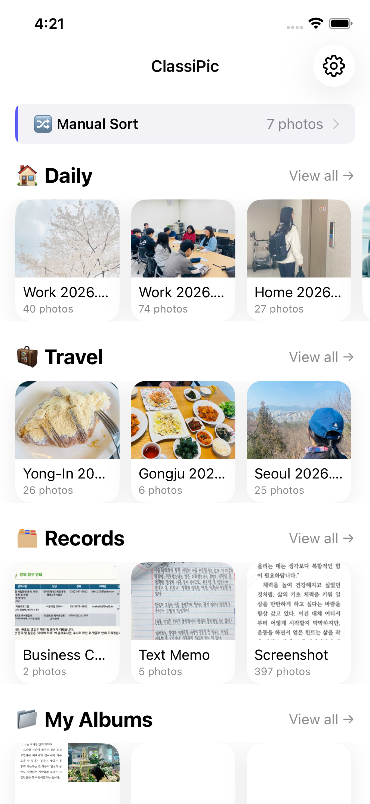
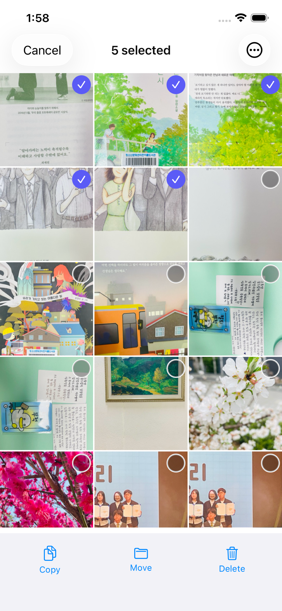
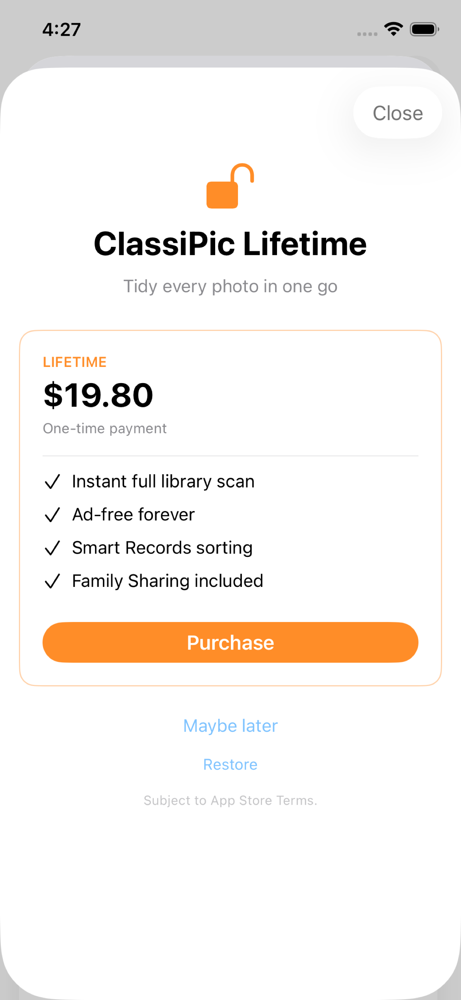

# ClassiPic 📸

**An iOS photo organizer that auto-sorts your library into Moments and Records, on-device.**

English | [한국어](README.md)

   

> 📱 [App Store](https://apps.apple.com/app/id6769269007) · 🔒 [Privacy Policy](https://sylar-jeon.github.io/classipic-privacy/) · 🌱 Prototype: [AlbumManager](https://github.com/sylar-Jeon/AlbumManager)

---

## At a glance

- **What it is** — An iOS photo organizer that automatically separates your camera roll into Moments (trips, daily life, family, food) and Records (receipts, business cards, screenshots, documents)
- **Stack** — Swift 6 · SwiftUI + @Observable · MVVM · PhotoKit · StoreKit 2 · CoreLocation · AdMob — **zero external dependencies**
- **Status** — Released on the App Store (1.1.0, May 2026). Solo project: design, build, submission, and operations

---

## Screenshots

| Home | Records | Duplicate | Paywall |
|---|---|---|---|
|  |  |  |  |

---

## Design principles

Five principles that hold the entire codebase together. Every decision in ClassiPic traces back to one of these.

### 1. iOS Photos Library = Single Source of Truth
- **No internal database** (no Core Data, SwiftData, or Realm)
- `PHAsset` / `PHAssetCollection` is the only truth
- Fresh read on every app launch and foreground return
- Deletes go to iOS "Recently Deleted" (30-day retention) — never permanent

### 2. 100% on-device privacy
- All AI classification runs locally on the device
- Photos and metadata never leave the phone
- Works without an internet connection

### 3. UI/UX parity with the iOS Photos app
- Match colors, spacing, and interactions of the system Photos app as closely as possible
- Minimize user learning cost
- Position as a complementary app that blends naturally with system tools

### 4. Zero external dependencies
- Zero CocoaPods/SPM dependencies
- Icons and animations use SF Symbols only
- Minimize build fragility and security review overhead
- Exception: Google AdMob / UserMessagingPlatform (precompiled framework, required for ad-supported monetization)

### 5. SwiftUI + @Observable MVVM
- View renders only / ViewModel holds business logic / Service handles system framework I/O
- TCA, Combine, and RxSwift are intentionally not used (see "Notable engineering decisions" below)

---

## Architecture

```
┌────────────────────────────────────────────────┐
│  View (SwiftUI)                                │
│  Rendering only, no business logic             │
└──────────────────────┬─────────────────────────┘
                       │  bind via @Observable
┌──────────────────────▼─────────────────────────┐
│  ViewModel (@Observable final class)           │
│  One per screen, @State private var vm = ...   │
└──────────────────────┬─────────────────────────┘
                       │  call shared services
┌──────────────────────▼─────────────────────────┐
│  Service (singleton)                           │
│  PhotoLibraryService.shared + 15 others        │
│  Talks to PhotoKit / StoreKit / CoreLocation   │
└────────────────────────────────────────────────┘
```

**Scale**: 70+ Swift files · 15+ feature modules · 16 services

**Key services**:

| Service | Responsibility |
|---|---|
| `PhotoLibraryService` | Owns all PhotoKit I/O — fetching albums and folders |
| `PhotoClassificationService` | AI classification logic (Moments / Records) |
| `MomentsClusteringService` | Time + location-based clustering for Moments |
| `AutoClassificationAgent` | Background classification of newly added photos |
| `ScanRegistry` | Classification state cache, incremental scan candidates |
| `SubscriptionService` | StoreKit 2 IAP, FeatureGate integration |
| `ScanUnlockManager` | AdMob rewarded ads → time-limited feature unlocks |
| `SmartNudgeService` | Context-aware nudge card display logic |
| `CurrentLocationFetcher` · `GeocoderCache` · `GeohashUtil` · `LocationAliasMap` | Location-based organization |
| `AdService` · `ATTrackingService` | Ads and ATT |
| `AppSettings` · `FeatureGate` | Settings and feature access gating |

---

## Notable engineering decisions

Each decision is paired with its trade-offs. Often "why we didn't do the obvious thing" matters more than what we did.

### Decision 1 — No internal DB; iOS Photos Library as SSOT

**Alternative**: Cache metadata in Core Data / SwiftData

**Chosen**: Use `PHAsset` directly. Zero internal DB.

**Reasoning**:
- Every album ClassiPic creates must also be visible in the iOS Photos app (the "companion app" positioning)
- Storing the same information in two places creates an endless stream of sync bugs
- iOS already handles backup, restore, and iCloud sync — no reason to rebuild that

**Cost accepted**:
- Every fetch hits PhotoKit → slight first-load latency on large libraries
- `ScanRegistry` compensates by caching only classification results (lightweight in-memory + UserDefaults)

**Generalized principle**: *"If we didn't create the data, we shouldn't own it."*

### Decision 2 — Standardize on @Observable; no TCA, no Combine

**Background**: I introduced TCA to a major commercial app (KineMaster, 2021) — one of the earliest production TCA adoptions in Korea. So I seriously considered TCA for ClassiPic.

**Chosen**: No TCA. `@Observable` + one ViewModel per screen, period.

**Reasoning (trade-offs)**:
- TCA's real value emerges when **multiple engineers concurrently edit the same domain reducer** — the store/effect model compresses merge conflict risk
- ClassiPic is a 1-person, ~70-file project. TCA boilerplate would cost more than it returns
- `@Observable` has been stable since iOS 17 — aligns with the zero-deps principle (adding TCA = +1 dependency, longer build times)
- Combine is excluded for the same reason. Swift Concurrency (async/await) is sufficient

**Generalized principle**: *"Tools depend on team size and domain complexity. The same engineer making different choices on different projects is correct, not inconsistent."*

### Decision 3 — Zero external dependencies

**Choice**: Zero CocoaPods/SPM dependencies. SF Symbols only for icons and animations.

**Why go this far?**:
- Solo operation — minimize time spent on dependency updates and security patching
- Native iOS APIs are rich enough that no external library is genuinely needed

**Cost accepted**:
- Some components built from scratch (e.g., `DragSelectableScrollView` — integrating UIKit drag-select gestures into SwiftUI)
- Owning the components means owning the debugging too. Including working around a Swift 6.3.2 `EarlyPerfInliner` SIL pass SIGSEGV (Release-build-only compiler crash) by adding an explicit `deinit` to the affected class

### Decision 4 — Monetization: no subscription, Lifetime only

**Market norm**: Most photo-organizer apps use monthly/yearly subscriptions

**Chosen**: Free + a single Lifetime IAP. Zero subscriptions.

**Reasoning**:
- "Photo organization is a one-time job" — that's the nature of this tool
- Monthly billing pressure is a churn trigger
- Subscription operational cost (renewals, refunds, tier permissions) outweighs the gain compared to the simplification of a one-time purchase

**Supplementary monetization**:
- Free users can watch an **AdMob rewarded ad** to unlock specific features for a month
- Users who've watched enough ads to feel the sunk cost see a sunk-cost variant of the paywall

**Cost accepted**:
- Lifetime revenue ceiling (LTV cap) — but the right price structure for the nature of the tool

---

## Working with AI tools

ClassiPic was built in collaboration with AI assistants (primarily Claude Code). The split of responsibilities is explicit.

| What AI did | What I did |
|---|---|
| Boilerplate and UI component code generation | Per-screen design and UX scenarios |
| Repetitive refactoring and renaming | **Architecture decisions** (the four above) |
| Compiler-error debugging assistance | **Trade-off judgment** |
| Adding localization keys | Code review and merge decisions |
| Drafting App Store metadata copy in English | App Store review handling, agreements, tax setup |

**Speed-up**: Roughly 3–5× faster shipping cycle compared to building the same scope without AI assistance (concept to App Store release in ~3 months)

**Limit**: AI doesn't make design decisions for you. Judgments like "why not TCA" remain your responsibility. AI just builds the code that follows those judgments, fast.

---

## Tech stack

| Area | Tech |
|---|---|
| Language | Swift 6.0 |
| UI | SwiftUI · @Observable |
| Architecture | MVVM (View → ViewModel → Service) |
| Concurrency | Swift Concurrency (async/await) |
| System frameworks | PhotoKit · StoreKit 2 · CoreLocation · AppTrackingTransparency |
| Monetization | StoreKit 2 IAP (Lifetime NonConsumable) · Google AdMob (rewarded) |
| Platform | iOS 17.6+ (iPhone only, Portrait only) |
| External deps | **0** (Google AdMob / UserMessagingPlatform precompiled framework excepted) |
| AI collaboration tools | Claude Code · Antigravity · opencode |

---

## Project status

- **May 2026** — App Store 1.1.0 release
- **Currently** — Released in non-EU markets (Korea, US, Japan, etc.) under Non-Trader status. EU markets to follow after Trader switch
- **Next** — Tuning classification categories based on user feedback, Records sub-classification, Face ID-locked album enhancements

---

## Links

- 📱 **App Store**: [ClassiPic](https://apps.apple.com/app/id6769269007)
- 🔒 **Privacy Policy**: [classipic-privacy](https://sylar-jeon.github.io/classipic-privacy/)
- 🌱 **Prototype**: [AlbumManager](https://github.com/sylar-Jeon/AlbumManager) — the toy project that became ClassiPic
- 💼 **Developer**: JaeMin Jeon (13+ years iOS, ex-KineMaster Lead)
- 📮 **Contact**: sylar32a+support@gmail.com

---

© 2026 sylar. All rights reserved.
