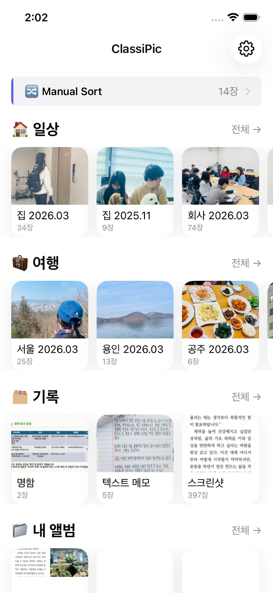
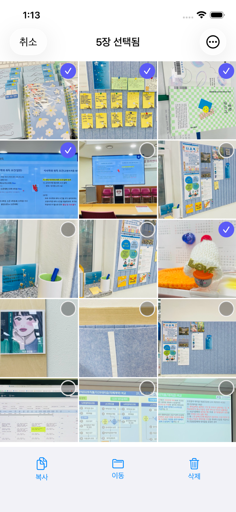
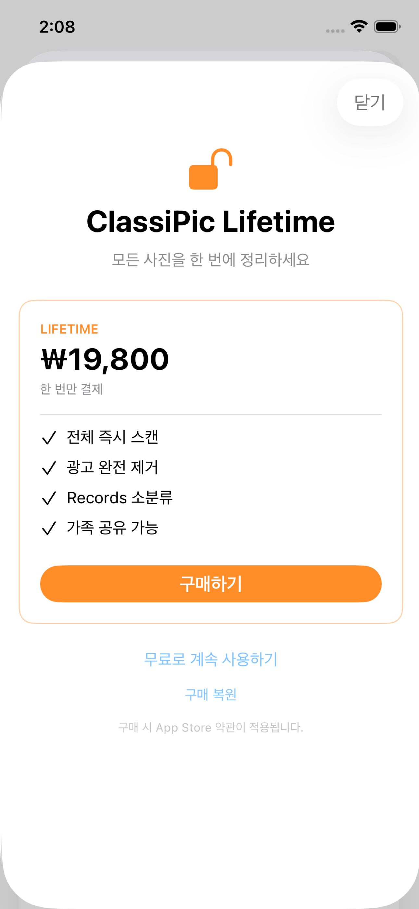

# ClassiPic 📸

**iOS 사진을 AI가 자동으로 추억·정보로 분류해 주는 사진 정리 앱**

[English](README.en.md) | 한국어

   

> 📱 [App Store](https://apps.apple.com/app/id6769269007) · 🔒 [Privacy Policy](https://sylar-jeon.github.io/classipic-privacy/) · 🌱 Prototype: [AlbumManager](https://github.com/sylar-Jeon/AlbumManager)

---

## At a glance

- **무엇인지** — 복잡해진 사진첩을 AI가 자동으로 분류해 주는 iOS 사진 정리 앱. 추억(Moments)과 정보(Records)로 자동 분리
- **기술** — Swift 6 · SwiftUI + @Observable · MVVM · PhotoKit · StoreKit 2 · CoreLocation · AdMob — **외부 의존성 0개**
- **상태** — App Store 1.1.0 출시 (2026.5). 1인 기획·개발·심사·운영

---

## Screenshots

| Home | Records | Duplicate | Paywall |
|---|---|---|---|
|  |  |  |  |

---

## Design principles

ClassiPic 코드베이스 전체를 일관되게 묶는 5가지 원칙. 모든 결정이 이 원칙을 따릅니다.

### 1. iOS Photos Library = Single Source of Truth
- 내부 DB(Core Data·SwiftData·Realm) **없음**
- `PHAsset` / `PHAssetCollection`이 유일한 진실
- 앱 실행·foreground 복귀마다 fresh read
- 삭제는 iOS "최근 삭제됨"으로 이동 (30일 보관, 영구 삭제 아님)

### 2. 100% on-device privacy
- 모든 AI 분류는 단말 안에서 처리
- 사진·메타데이터 외부 전송 0
- 인터넷 연결 없이 동작

### 3. iOS Photos 앱 UI/UX 패리티
- 색·간격·인터랙션을 iOS 기본 사진 앱과 가능한 한 같게
- 사용자 학습 비용 최소화
- 시스템 앱과 자연스럽게 섞이는 보조 앱 포지셔닝

### 4. Zero external dependencies
- CocoaPods/SPM 의존성 0개
- 아이콘·애니메이션은 SF Symbol만 사용
- 빌드 안정성·보안 검토 부담 최소화
- 예외: Google AdMob / UserMessagingPlatform (광고 수익화 요구사항상 precompiled framework만)

### 5. SwiftUI + @Observable MVVM
- View는 렌더링만 / ViewModel은 비즈니스 로직 / Service는 시스템 프레임워크 통신만
- TCA·Combine·RxSwift 의도적 미사용 (아래 "Notable engineering decisions" 참조)

---

## Architecture

```
┌────────────────────────────────────────────────┐
│  View (SwiftUI)                                │
│  렌더링만, 비즈니스 로직 없음                   │
└──────────────────────┬─────────────────────────┘
                       │  bind via @Observable
┌──────────────────────▼─────────────────────────┐
│  ViewModel (@Observable final class)           │
│  화면당 1개, @State private var vm = XxxVM()   │
└──────────────────────┬─────────────────────────┘
                       │  call shared services
┌──────────────────────▼─────────────────────────┐
│  Service (singleton)                           │
│  PhotoLibraryService.shared 외 15종            │
│  PHPhotoLibrary / StoreKit / CoreLocation 통신 │
└────────────────────────────────────────────────┘
```

**규모**: 70+ Swift 파일 · 15+ Feature 모듈 · 16 Service

**주요 Service**:

| Service | 역할 |
|---|---|
| `PhotoLibraryService` | PHPhotoLibrary 통신 전담, 앨범·폴더 fetch |
| `PhotoClassificationService` | AI 분류 로직 (Moments / Records) |
| `MomentsClusteringService` | 시간·위치 기반 추억 군집화 |
| `AutoClassificationAgent` | 백그라운드 신규 사진 자동 분류 |
| `ScanRegistry` | 분류 상태 캐시, 증분 스캔 후보 계산 |
| `SubscriptionService` | StoreKit 2 IAP, FeatureGate 연동 |
| `ScanUnlockManager` | AdMob rewarded 광고 → 한시 기능 해금 |
| `SmartNudgeService` | 컨텍스트 기반 nudge 카드 노출 결정 |
| `CurrentLocationFetcher` · `GeocoderCache` · `GeohashUtil` · `LocationAliasMap` | 위치 기반 정리 |
| `AdService` · `ATTrackingService` | 광고·ATT |
| `AppSettings` · `FeatureGate` | 설정·기능 접근 게이트 |

---

## Notable engineering decisions

각 결정마다 트레이드오프를 같이 적었습니다. "왜 그렇게 안 했나"가 더 중요한 경우도 많아서.

### Decision 1 — 내부 DB 없이 iOS Photos Library를 SSOT로

**대안**: Core Data / SwiftData로 메타데이터 캐싱

**선택**: PHAsset 직접 사용. 내부 DB 0

**이유**:
- ClassiPic이 만든 모든 앨범은 iOS 사진 앱에서도 그대로 보여야 함 (보조 앱 포지셔닝)
- 양쪽에 같은 정보를 따로 저장하면 sync 버그가 끊임없이 생김
- 백업·복원·iCloud 동기화는 iOS가 알아서 처리 → 우리가 다시 만들 이유 없음

**감수한 비용**:
- 매 fetch가 PhotoKit 호출 → 큰 라이브러리에서 첫 로드 살짝 느림
- `ScanRegistry`로 분류 결과만 가벼운 in-memory + UserDefaults 캐시로 보완

**판단의 일반화**: *"데이터를 우리가 만든 게 아니면, 우리가 소유하지 말자."*

### Decision 2 — @Observable로 통일, TCA·Combine 미사용

**배경**: 이전 직장(KineMaster)에서 TCA를 국내 최초 수준으로 상용 도입한 경험이 있어, ClassiPic에 TCA를 쓸지 진지하게 고민함

**선택**: TCA 안 씀. `@Observable` + 화면당 ViewModel 1개로 통일

**이유 (트레이드오프)**:
- TCA의 진짜 가치는 **여러 명이 같은 도메인 reducer를 동시 수정**할 때 나옴 — store/effect 모델이 충돌 가능성을 압축
- ClassiPic은 1인 프로젝트 + 70 파일 규모. TCA 보일러플레이트가 가치보다 비용이 큼
- `@Observable`은 iOS 17부터 안정적 — 의존성 0 원칙과도 맞음 (TCA 추가 시 의존성 +1, 빌드 시간 ↑)
- Combine도 같은 이유로 의도적 배제. Swift Concurrency(async/await)로 충분

**판단의 일반화**: *"도구는 팀 규모·도메인 복잡도에 종속된다. 같은 사람이 다른 프로젝트에서 다른 선택을 하는 게 정상."*

### Decision 3 — 외부 의존성 0

**선택**: CocoaPods·SPM 의존성 0개. 아이콘·애니메이션은 SF Symbol만

**왜 그렇게까지?**:
- 1인 운영이라 의존성 업데이트·보안 패치 대응 시간을 최소화하고 싶음
- iOS native API가 충분히 풍부 — 굳이 필요한 외부 라이브러리가 없음

**감수한 비용**:
- 일부 컴포넌트 직접 구현 (예: `DragSelectableScrollView` — UIKit drag-select gesture를 SwiftUI에 통합)
- 직접 구현한 만큼 디버깅도 본인 몫. Swift 6.3.2 `EarlyPerfInliner` SIL pass의 SIGSEGV 컴파일러 크래시(Release 빌드 한정)도 명시적 `deinit` 추가로 직접 회피 우회

### Decision 4 — 수익화: 구독 없음, Lifetime만

**시장 표준**: 사진 정리 앱은 대부분 월간/연간 구독

**선택**: Free + Lifetime 단일 IAP. 구독 0

**이유**:
- "사진은 한 번 정리하면 끝"이라는 도구의 본질
- 매월 결제 부담 = 사용자 이탈 트리거
- 구독 운영 비용(갱신·환불·등급별 권한) 대비 단순화 이득이 큼

**보조 수익화**:
- Free 사용자에게 **AdMob rewarded 광고** 시청 시 일부 기능 한 달 해금
- 매몰비용을 느낄 만큼 광고를 본 사용자에게는 매몰비용 변형 paywall 노출

**감수한 비용**:
- 평생 수익 상한 (LTV ceiling) — 그래도 도구의 본질에 맞는 가격 구조라 판단

---

## Working with AI tools

ClassiPic은 Claude Code 등 AI 어시스턴트와 협업한 결과물입니다. 분담은 명확합니다.

| AI가 한 것 | 사람이 한 것 |
|---|---|
| 보일러플레이트·UI 컴포넌트 코드 생성 | 화면 단위 기획·UX 시나리오 |
| 반복 리팩토링·rename | **아키텍처 결정** (위 4가지) |
| 컴파일 에러 디버깅 보조 | **트레이드오프 판단** |
| 로컬라이제이션 키 추가 | 코드 리뷰·머지 결정 |
| App Store 메타데이터 영문 카피 초안 | App Store 심사 대응·계약·세금 처리 |

**가속 효과**: 동일 규모 앱을 기존 방식으로 만들 때 대비 약 3~5배 빠른 출시 사이클 (기획부터 출시까지 약 3개월)

**한계**: AI가 디자인 결정을 대신 내려주진 않음. "왜 TCA를 안 쓰는가" 같은 판단은 본인 책임. AI는 그 판단을 따라 빠르게 코드를 만들어 줄 뿐.

---

## Tech stack

| 영역 | 사용 기술 |
|---|---|
| Language | Swift 6.0 |
| UI | SwiftUI · @Observable |
| Architecture | MVVM (View → ViewModel → Service) |
| Concurrency | Swift Concurrency (async/await) |
| System frameworks | PhotoKit · StoreKit 2 · CoreLocation · AppTrackingTransparency |
| Monetization | StoreKit 2 IAP (Lifetime NonConsumable) · Google AdMob (rewarded) |
| Platform | iOS 17.6+ (iPhone only, Portrait only) |
| External deps | **0** (Google AdMob / UserMessagingPlatform precompiled framework만 예외) |
| AI 협업 도구 | Claude Code · Antigravity · opencode |

---

## Project status

- **2026.05** — App Store 1.1.0 출시
- **현재** — Non-Trader 모드로 한국·미국·일본 등 비EU 마켓 출시. EU는 Trader 전환 후 추가 예정
- **다음** — 사용자 피드백 기반 분류 카테고리 미세조정, Records 소분류, Face ID 잠금 앨범 강화

---

## Links

- 📱 **App Store**: [ClassiPic](https://apps.apple.com/app/id6769269007)
- 🔒 **Privacy Policy**: [classipic-privacy](https://sylar-jeon.github.io/classipic-privacy/)
- 🌱 **Prototype**: [AlbumManager](https://github.com/sylar-Jeon/AlbumManager) — ClassiPic의 출발점이 된 토이 프로젝트
- 💼 **개발자**: 전재민 (13+ years iOS, ex-KineMaster Lead)
- 📮 **Contact**: sylar32a+support@gmail.com

---

© 2026 sylar. All rights reserved.
